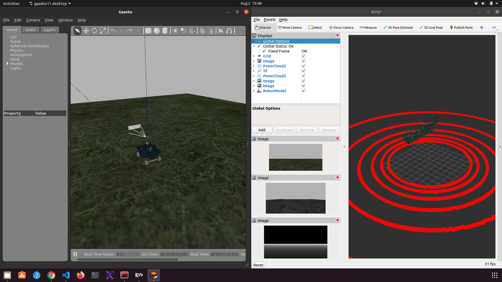

# ros2_full_sensor_suite

This is a ROS2 package that aims to provide easy integration for simulation of essential sensors for mobile robots. 

The sensor suite consists of following components; 

| Sensor type | Topic Name(s) | Message Type | Update Rate |
| :---: | :---: | :---: | :---: |
| LIDAR | /velodyne_points | sensor_msgs::msg::PointCloud2 | 30 |
| COLOR CAMERA | /camera/color/image_raw | sensor_msgs::msg::Image | 30 |
| DEPTH CAMERA | /camera/aligned_depth_to_color/image_raw | sensor_msgs::msg::Image | 30 |
| IR1 CAMERA | /camera/infra1/image_raw | sensor_msgs::msg::Image | 1 |
| IR2 CAMERA | /camera/infra2/image_raw | sensor_msgs::msg::Image | 1 |
| WIDE ANGLE CAMERA | /wide_angle_camera/image_raw | sensor_msgs::msg::Image | 1 |
| GPS | /gps/fix | sensor_msgs::msg::NavSatFix | 30 |
| IMU | /imu | sensor_msgs::msg::Imu | 30 |

All this sensors are composed to one gazebo model named `full_sensor_suite`. Refer to models folder to find the related files. 
There is also a Gazebo World plugin, which is used to attach the sensor suite model to any robot model.
See the provided `test.world` for example usage.

Many of this sensor plugins are already available in official [gazebo_ros_pkgs](https://github.com/ros-simulation/gazebo_ros_pkgs),
However some sensors such as GPS and IMU were troublesome to get them work with [robot_localization](http://wiki.ros.org/robot_localization). 

GPS and IMUs from [hector_gazebo](https://github.com/tu-darmstadt-ros-pkg/hector_gazebo) were ported to ROS2 to resolve the issues. 


# Installation requirements

This code was developed under Ubuntu 20.04 with Foxy version of ROS2. 
Make sure to have a similar setup. 

clone this repo to your workspace/src and let the rosdep resolve dependencies with ; 

>  rosdep install -y -r -q --from-paths src --ignore-src --rosdistro foxy 

finally build with colcon;

> colcon build --symlink-install --cmake-args -DCMAKE_BUILD_TYPE=Release --parallel-workers 4

# Example usage 
 
Replace `botanbot` with you robot name and change the fileds in sensor_base_attacher_plugin accordingly. 

 ```xml
<?xml version="1.0"?>
    <sdf version="1.6">
        .
        .
        .
        <world name="test_world">   
            <include>
                <pose>0.0 0 0.5 0.0 0.0 0.0</pose>
                <uri>model://botanbot</uri>
            </include>

            <include>
                <pose>0.0 0 1.0 0.0 0.0 0.0</pose>
                <uri>model://full_sensor_suite</uri>
            </include>

            <plugin name="sensor_base_attacher_plugin" filename="libsensor_base_attacher_plugin.so">
                <robot_model_name>botanbot</robot_model_name>
                <robot_base_link_name>base_link</robot_base_link_name>
                <sensor_suite_model_name>full_sensor_suite</sensor_suite_model_name>
                <sensor_suite_base_link_name>base_sensor_link</sensor_suite_base_link_name>
            </plugin>
            .
            .
            .
        </world>
    </sdf>            
```

Launch the world file with; 

> export GAZEBO_MODEL_PATH=/home/atas/colcon_ws/src/ros2_full_sensor_suite/models
> ros2 launch ros2_full_sensor_suite test.launch.py

replace the `GAZEBO_MODEL_PATH` according to your local path. This is important as otherwise Gazebo would not be able to locate the models.

Open RVIZ2 in another terminal, set the global frame to `base_link`. You can view various incoming sensor data such as LIDAR, depth cloud, images etc.; 



Note that since the depth camera pointcloud is coming from optical frmae, the cloud looks strange, 
you will need to do transfrom e.g(depth_camera_optical_frame -> base_link) 
so that the point cloud from depth camera will look more meaningful. 

Some sensor data cannot be visualized through RVIZ2, but you can just subscribe to a topic to echo the data. 

e.g 

> ros2 topic echo /imu/data

or the same from gps

> ros2 topic echo /gps/fix